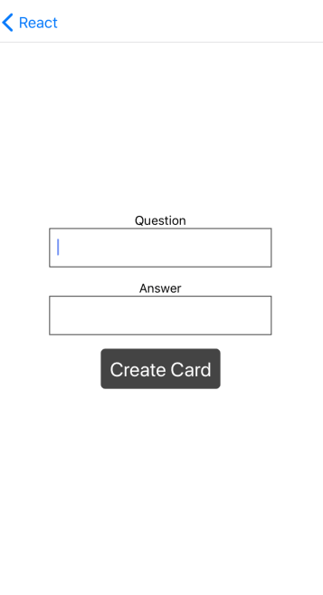

# Flashcard
## Contents
- The initial Deck View shows the current decks with the card name and number of cards.

- When you click a card, it'll take you to the individual deck view. The individual deck view has:
    - The deck title
    - Number of cards in the deck
    - Option to start a quiz for that deck
    - Option to add a new question to the deck

- Pressing the 'Start a Quiz' or 'Add Card' button properly routes to the correct views for those activities.

- The New Question view includes a form with fields for a question and answer, and a submit button.

- Quiz View:
    - starts with a question from the selected deck.

    - The question is displayed, along with a button to show the answer.

    - Pressing the 'Show Answer' button displays the answer.

    - Buttons are included to allow the student to mark their guess as 'Correct' or 'Incorrect'

    - The view displays the number of questions remaining.

    - When the last question is answered, a score is displayed. This can be displayed as a percentage of correct answers or just the number of questions answered correctly.

    - When the score is displayed, buttons are displayed to either start the quiz over or go back to the Individual Deck view.

    - Both the 'Restart Quiz' and 'Back to Deck' buttons route correctly to their respective views.

## Installation
1. Install the project:

`$git clone https://github.com/misakimichy/react-native-udacicards.git`

2. Open it with the [Expo](https://expo.io) to view it.

3. If you view this from your Mac or computer, please install the Emulator.

## License
Copyright © 2019 under the MIT License